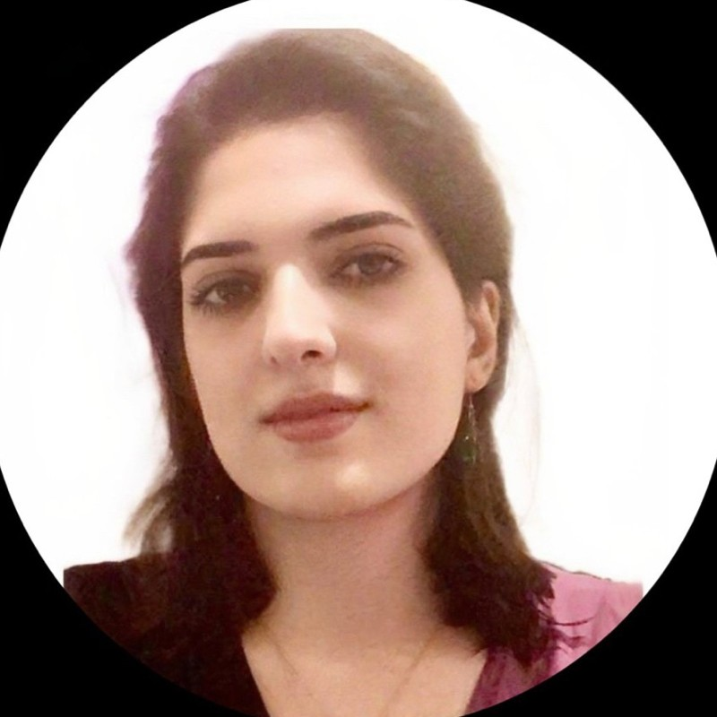
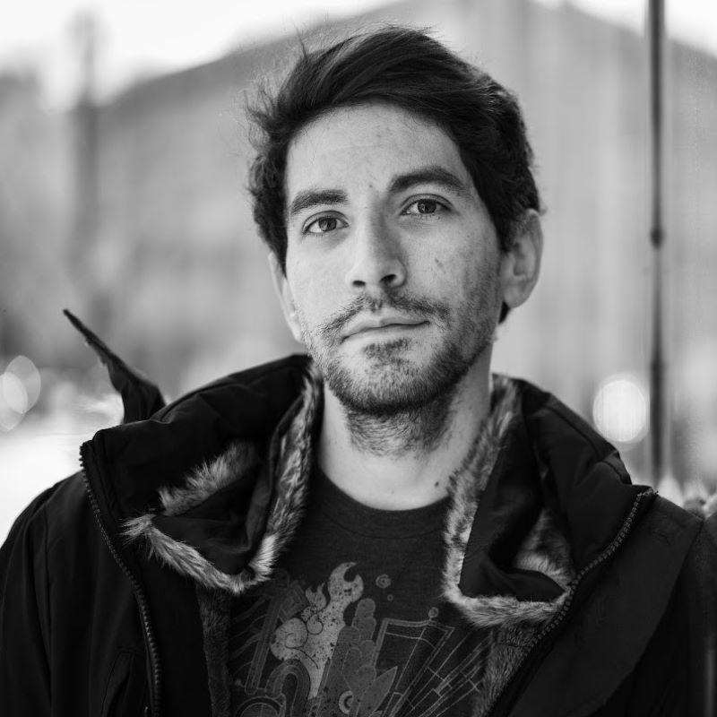
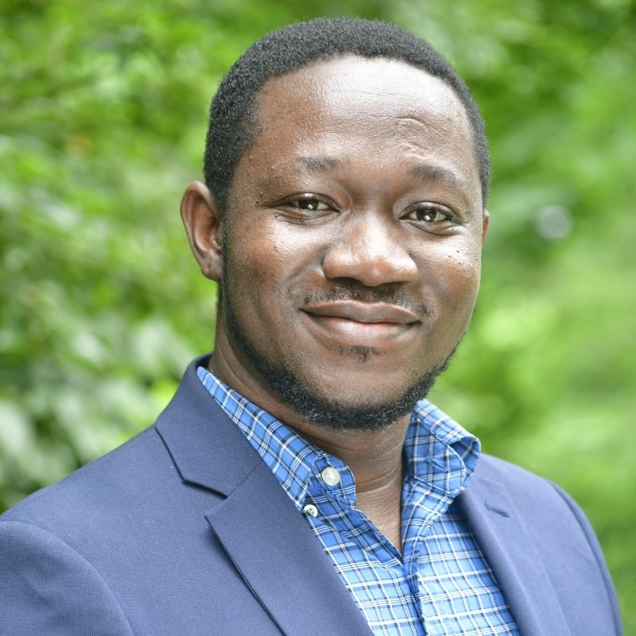

# Tutors and Contributors

## In-Person Presenters

### Sara Abdali

**Affiliation:** Microsoft  
**Email:** [saraabdali@microsoft.com](mailto:saraabdali@microsoft.com)  
**Address:** One Microsoft Way Redmond, WA 98052  
**Phone:** +1(424)3474196  
Sara Abdali is a researcher at Applied Sciences Group (ASG) at Microsoft, where she actively contributes to NLP and Multimodal Generative AI projects. Prior to joining Microsoft, she was selected as a postdoctoral CIFellow at Georgia Tech, where she received funding from the NSF to work on "Adversarially Robust Multimodal Misinformation Detection". Additionally, she was a recipient of the Dean’s Distinguished Fellowship Award for her Ph.D. studies at the University of California, Riverside (UCR). Her research during this time spanned various areas, including misinformation detection, deep fake video detection, and other NLP projects.

### CJ Barberan

**Affiliation:** Microsoft  
**Email:** [cjbarberan@microsoft.com](mailto:cjbarberan@microsoft.com)  
**Address:** 1 Memorial Dr, Cambridge, MA, USA, 02142  
**Phone:** +1 (915) 479-7207  
CJ Barberan received his PhD in April 2022 from Rice University and now serves as an Applied Scientist at Microsoft AI Development Acceleration Program. Within Microsoft he is involved in LLM and other Generative AI projects. CJ’s achievements include receiving prestigious fellowships such as the NSF GRFP, NDSEG, GEM (sponsored by MIT Lincoln Lab), and Ford Foundation Pre-Doctoral Fellowships.

### Jia He

**Affiliation:** Microsoft  
**Email:** [hejia@microsoft.com](mailto:hejia@microsoft.com)  
**Address:** 1 Memorial Dr, Cambridge, MA, USA, 02142  
**Phone:** +1 (857) 4536097  
Jia is an Applied Scientist at Microsoft. She is part of Microsoft AI Development Acceleration Program where she works on different AI and ML related projects across the company, including using LLMs for code translation, code evaluation and bug fix. Prior to Microsoft, she received her PhD from Illinois Institute of Technology. Her PhD research spanned different domains including graph representation learning, generative AI, anomaly detection, imbalanced data classification, etc., which have received multiple NSF awards.

## Contributors

### Richard Anarfi

**Affiliation:** Microsoft  
**Email:** [ranarfi@microsoft.com](mailto:ranarfi@microsoft.com)  
**Address:** 1 Memorial Dr, Cambridge, MA, USA, 02142  
**Phone:** +1 (617) 7089282  
Richard completed his PhD in Computer Science at the University of Massachusetts Boston in May 2022, where he specialized in recommendation systems. Currently, he is an Applied Scientist within the Microsoft AI Development Acceleration Program, contributing to various LLM Copilot projects across the company. His expertise lies in leveraging advanced AI and ML techniques to enhance user experiences and decision-making processes in technology applications.

